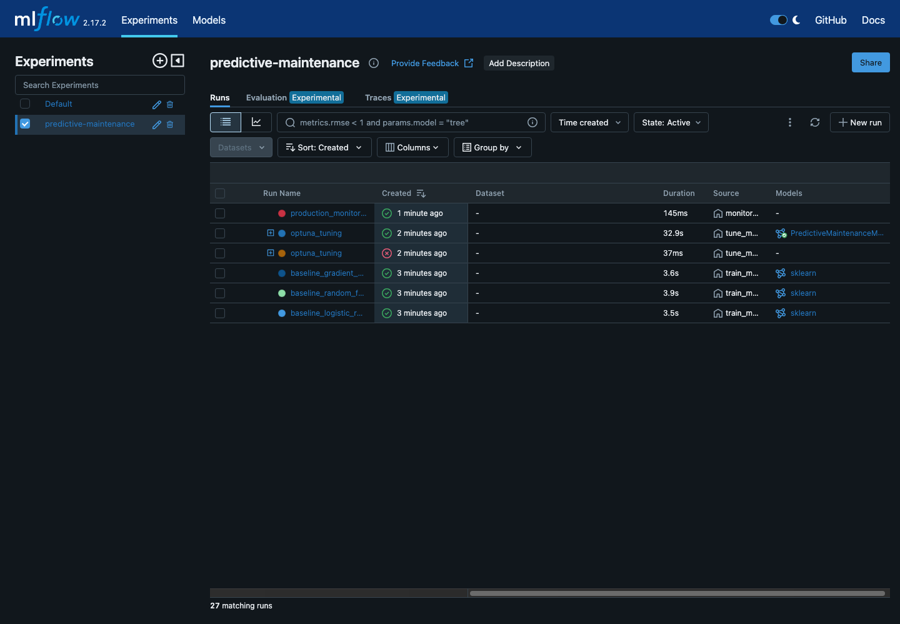
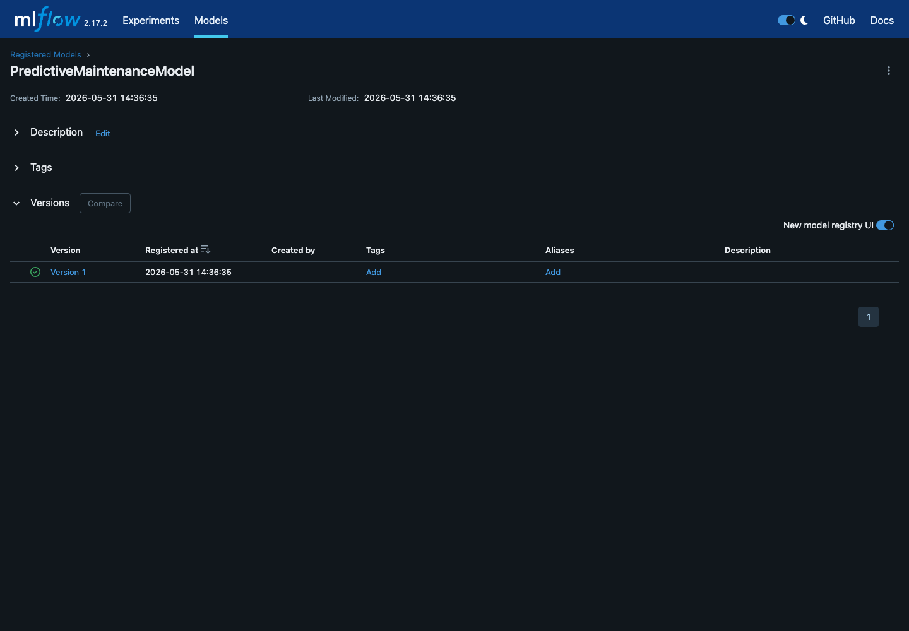
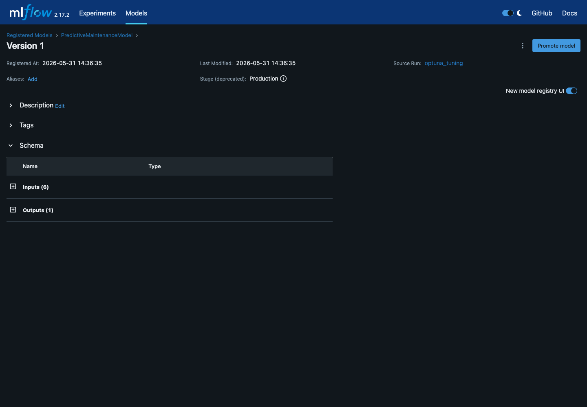
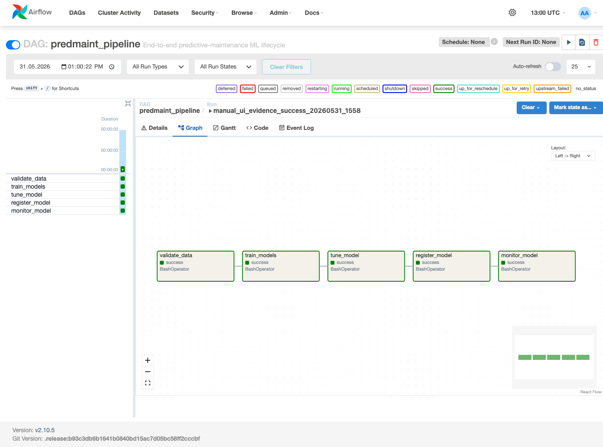
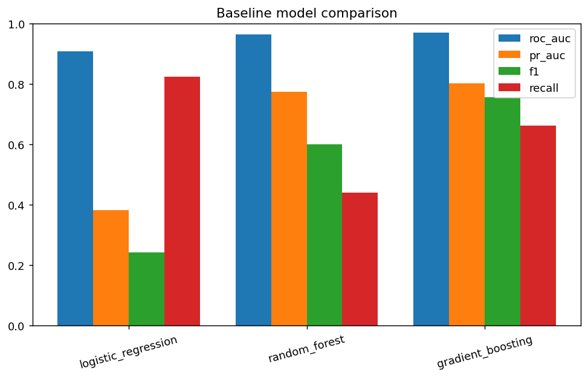
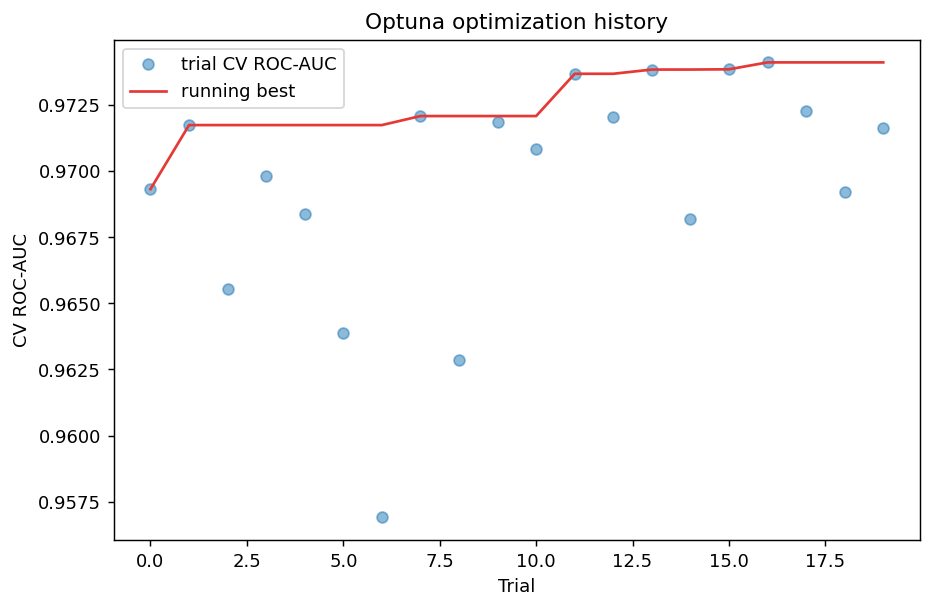
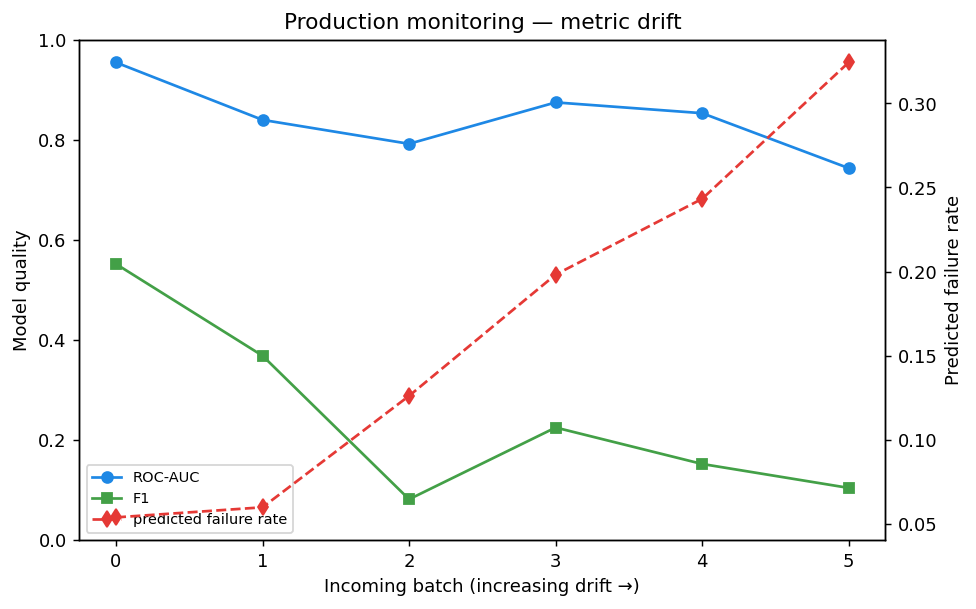
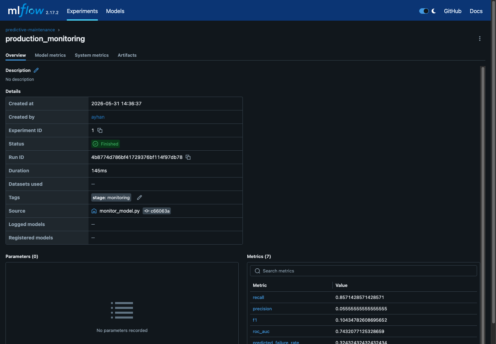

# Predictive Maintenance — End-to-End ML Lifecycle on Azure ML + MLflow


**Course:** AIN-3009 Delivering AI Applications with MLOps
**Term Project:** Development and Evaluation of a Machine Learning Lifecycle Management System using MLflow

This project manages the full ML lifecycle for an industrial **predictive
maintenance** task: predicting machine failure from sensor readings. MLflow is
used for experiment tracking, hyperparameter tuning, the model registry, and
monitoring, with **Azure Machine Learning** acting as the remote MLflow tracking
server, model registry, and **Managed Online Endpoint** for real-time serving.

## Assignment Coverage

| Requirement | How this project satisfies it |
|---|---|
| Domain and dataset | Industrial predictive maintenance with the AI4I 2020 sensor dataset |
| Experiment tracking | MLflow logs parameters, metrics, artifacts, reports, and model files |
| Model training | Logistic Regression, Random Forest, and Gradient Boosting baselines |
| Hyperparameter tuning | Optuna tuning with 20 MLflow-tracked trials |
| Model registry | `PredictiveMaintenanceModel` registered and promoted through lifecycle stages |
| Deployment | Azure ML Managed Online Endpoint deployment scripts and evidence |
| Monitoring | Simulated incoming batches with drift metrics logged back to MLflow |
| Pipeline automation | Airflow DAG: validate → train → tune → register → monitor |
| Report | Detailed methodology and results in `reports/project_report.md` |

## Why Azure ML

The Azure ML workspace *is* an MLflow tracking server. By pointing the standard
MLflow client at the workspace URI, every experiment, run, and registered model
appears in Azure ML Studio with no code change, and the best model is deployed to
a managed REST endpoint. Training and tuning run locally (no compute cost); only
the online endpoint incurs charges, and it is deleted after the demo.

## Domain & Dataset

- **Dataset:** AI4I 2020 Predictive Maintenance (UCI), 10,000 rows.
- **Target:** `Machine failure` (binary). Failure rate ≈ 3.4% → class imbalance.
- **Features:** air/process temperature, rotational speed, torque, tool wear,
  machine `Type` (L/M/H).
- **Leakage control:** the per-mode failure flags (TWF, HDF, PWF, OSF, RNF) are
  dropped because they encode the target.

## Architecture

```
Local machine (training + tuning)
   │  mlflow.set_tracking_uri(azureml://...)
   ▼
Azure ML Workspace ── Experiments / Tracking (Studio UI)
   │                  Model Registry (Staging → Production)
   ▼
Managed Online Endpoint ── REST /score (real-time prediction)
   ▲
Monitoring (drift simulation → metrics logged back to Azure ML)
```

## System Workflow

1. **Dataset preparation:** load AI4I 2020, remove leakage columns, split data.
2. **Preprocessing:** scale numeric sensor features and one-hot encode machine type.
3. **Training:** compare multiple scikit-learn models and log every run to MLflow.
4. **Tuning:** optimize the selected model with Optuna and track every trial.
5. **Registry:** register the best model as a versioned MLflow/Azure ML model.
6. **Deployment:** deploy the production model as an Azure ML online endpoint.
7. **Monitoring:** simulate incoming drifted batches and log performance changes.
8. **Orchestration:** Airflow represents the lifecycle as a repeatable DAG.

## Visual Evidence

### MLflow experiment tracking



### Model registry and production version





### Airflow pipeline automation



### Model comparison and tuning results





### Production monitoring and drift





## Project Structure

```text
PRJ-AyhanGurbangeldiyev-2020053/
├── azure/
│   ├── setup_workspace.sh      # Provision RG + workspace, write .env
│   └── deploy_endpoint.py      # Deploy/delete managed online endpoint
├── data/ai4i2020.csv
├── src/
│   ├── config.py               # Tracking URI (Azure ML or local fallback)
│   ├── data_preprocessing.py   # Load, clean, split, preprocessing pipeline
│   ├── train_models.py         # Baseline models + MLflow tracking
│   ├── tune_model.py           # Optuna tuning, every trial logged
│   ├── register_model.py       # Register best model + stage transitions
│   ├── serve_test.py           # Call the live endpoint
│   └── monitor_model.py        # Drift simulation + metric logging
├── reports/                    # CSV/JSON outputs of every stage
├── screenshots/                # MLflow, Airflow, metrics, and registry evidence
├── requirements.txt
└── README.md
```

## Setup

```bash
python3.11 -m venv .venv
source .venv/bin/activate
pip install -r requirements.txt
```

### Provision Azure ML (one time)

```bash
az login
bash azure/setup_workspace.sh        # creates workspace, writes .env
```

`setup_workspace.sh` writes `AZURE_ML_TRACKING_URI` to `.env`. If `.env` is
absent or the URI is empty, every script automatically falls back to a local
SQLite tracking store, so the pipeline also runs fully offline.

## Run the Pipeline

```bash
# 1. Validate the dataset
PYTHONPATH=src python src/data_preprocessing.py

# 2. Train baselines (logged to Azure ML)
PYTHONPATH=src python src/train_models.py

# 3. Hyperparameter tuning with Optuna
PYTHONPATH=src python src/tune_model.py --trials 20

# 4. Register the best model + Staging→Production
PYTHONPATH=src python src/register_model.py

# 5. Deploy as a managed online endpoint
python azure/deploy_endpoint.py

# 6. Test the live endpoint
PYTHONPATH=src python src/serve_test.py

# 7. Simulate monitoring with drift
PYTHONPATH=src python src/monitor_model.py --batches 6

# 8. Tear down the endpoint to stop billing
python azure/deploy_endpoint.py --delete
```

## Results (local validation run)

| Model | ROC-AUC | PR-AUC | F1 | Recall |
|---|---|---|---|---|
| Logistic Regression | 0.907 | 0.382 | 0.242 | 0.824 |
| Random Forest | 0.963 | 0.775 | 0.600 | 0.441 |
| Gradient Boosting | 0.970 | 0.801 | 0.756 | 0.662 |
| **Optuna-tuned RF** | **0.970** (test) / 0.974 (CV) | 0.785 | 0.712 | 0.765 |

Monitoring shows ROC-AUC degrading from ~0.91 to ~0.77 across six increasingly
drifted batches, while the predicted failure rate inflates from 4% to 37% — the
signal a retraining trigger would watch.

## Deployment Evidence

Azure ML was used for the remote MLflow tracking server, registry, and managed
online endpoint:

- Workspace: `mlw-predmaint` in `swedencentral`
- Resource group: `rg-mlops-predmaint`
- Registered model: `PredictiveMaintenanceModel`, version `1`
- Managed endpoint: `predmaint-endpoint`, provisioning state `Succeeded`

The endpoint credentials are kept only in the local ignored `.env` file. The
submission package includes `.env.example`, not `.env`, so secrets are not
submitted. The repository includes MLflow, Airflow, model registry, monitoring, and
metric evidence in the `screenshots/` folder.

## Cost Note

Only the managed online endpoint bills (≈ a few US$ on `Standard_DS2_v2`).
Always run `python azure/deploy_endpoint.py --delete` after the demo if the
endpoint is no longer needed.
